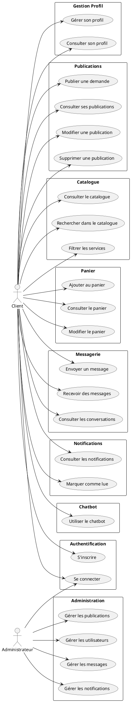

# Guide : Créer le Diagramme de Cas d'Utilisation

## Étape 1 : Accéder à Draw.io

1. Allez sur **https://app.diagrams.net/** (ou https://draw.io)
2. Cliquez sur **"Create New Diagram"**
3. Choisissez **"Blank Diagram"**
4. Donnez un nom : "Cas d'utilisation - Fixer"

## Étape 2 : Ajouter les Acteurs

### Acteurs principaux :
- **Client** (utilisateur normal)
- **Administrateur** (admin)

### Comment ajouter :
1. Dans la barre latérale gauche, cherchez **"UML"** ou tapez "actor" dans la recherche
2. Glissez-déposez l'icône **"Actor"** sur le canvas
3. Double-cliquez pour renommer : "Client"
4. Répétez pour "Administrateur"
5. Placez-les de chaque côté du diagramme

## Étape 3 : Ajouter les Cas d'Utilisation

### Cas d'utilisation pour le CLIENT :

#### Authentification et Profil
- S'inscrire
- Se connecter
- Gérer son profil
- Consulter son profil

#### Publications
- Publier une demande de réparation
- Consulter ses publications
- Modifier une publication
- Supprimer une publication

#### Catalogue
- Consulter le catalogue
- Rechercher dans le catalogue
- Filtrer les services
- Voir les détails d'un service

#### Panier
- Ajouter un service au panier
- Consulter le panier
- Modifier le panier
- Supprimer un article du panier

#### Messagerie
- Envoyer un message
- Recevoir des messages
- Consulter les conversations
- Envoyer un fichier dans un message

#### Notifications
- Consulter les notifications
- Marquer une notification comme lue
- Marquer toutes les notifications comme lues

#### Chatbot
- Utiliser le chatbot
- Rechercher via le chatbot

### Cas d'utilisation pour l'ADMINISTRATEUR :

#### Gestion des Publications
- Consulter toutes les publications
- Vérifier une publication
- Refuser une publication
- Supprimer une publication
- Créer une publication vérifiée

#### Gestion des Utilisateurs
- Consulter tous les utilisateurs
- Modifier un utilisateur
- Supprimer un utilisateur
- Changer le rôle d'un utilisateur

#### Gestion des Messages
- Consulter tous les messages
- Supprimer un message

#### Gestion des Notifications
- Consulter toutes les notifications
- Créer une notification

### Comment ajouter :
1. Dans la barre latérale, cherchez **"Use Case"** ou utilisez l'ellipse (ovale)
2. Glissez-déposez plusieurs ellipses sur le canvas
3. Double-cliquez sur chaque ellipse pour renommer avec les cas d'utilisation ci-dessus
4. Organisez-les en groupes logiques (regroupez par fonctionnalité)

## Étape 4 : Relier les Acteurs aux Cas d'Utilisation

1. Utilisez l'outil **"Connector"** (ligne) dans la barre d'outils
2. Cliquez sur l'acteur "Client" et tirez vers les cas d'utilisation du client
3. Cliquez sur l'acteur "Administrateur" et tirez vers les cas d'utilisation de l'admin
4. Utilisez des lignes droites ou des lignes avec angles

## Étape 5 : Organiser le Diagramme

### Structure recommandée :

```
                    [CLIENT]
                         |
        ┌────────────────┼────────────────┐
        |                |                 |
    [Authentification] [Publications] [Catalogue]
        |                |                 |
    [Profil]         [Panier]         [Messagerie]
        |                |                 |
    [Notifications]  [Chatbot]        [Recherche]
```

```
                [ADMINISTRATEUR]
                         |
        ┌────────────────┼────────────────┐
        |                |                 |
    [Gestion Publications] [Gestion Utilisateurs]
        |                |                 |
    [Gestion Messages] [Gestion Notifications]
```

## Étape 6 : Ajouter les Relations (Optionnel)

Si certains cas d'utilisation incluent d'autres :
- Utilisez une flèche avec le stéréotype **<<include>>**
- Si un cas d'utilisation étend un autre : **<<extend>>**

Exemples :
- "Consulter le catalogue" **<<include>>** "Rechercher dans le catalogue"
- "Publier une demande" **<<include>>** "Uploader un fichier"

## Étape 7 : Styliser le Diagramme

1. Sélectionnez tous les éléments (Ctrl+A)
2. Dans le panneau de droite, ajustez :
   - **Couleur de remplissage** : Blanc ou léger
   - **Couleur du texte** : Noir
   - **Police** : Arial ou Calibri, taille 12
   - **Bordure** : Noir, épaisseur 2px

## Étape 8 : Exporter en PNG

1. Cliquez sur **"File"** → **"Export as"** → **"PNG"**
2. Choisissez une résolution élevée : **300 DPI** (pour l'impression)
3. Cochez **"Transparent background"** (fond transparent)
4. Cliquez sur **"Export"**
5. Sauvegardez dans : `images/diagrammes/cas_utilisation.png`

## Structure Complète du Diagramme

### Zone Client (gauche) :
```
[CLIENT]
    ├── S'inscrire
    ├── Se connecter
    ├── Gérer son profil
    ├── Consulter son profil
    ├── Publier une demande de réparation
    ├── Consulter ses publications
    ├── Modifier une publication
    ├── Supprimer une publication
    ├── Consulter le catalogue
    ├── Rechercher dans le catalogue
    ├── Filtrer les services
    ├── Voir les détails d'un service
    ├── Ajouter un service au panier
    ├── Consulter le panier
    ├── Modifier le panier
    ├── Supprimer un article du panier
    ├── Envoyer un message
    ├── Recevoir des messages
    ├── Consulter les conversations
    ├── Consulter les notifications
    ├── Marquer une notification comme lue
    └── Utiliser le chatbot
```

### Zone Administrateur (droite) :
```
[ADMINISTRATEUR]
    ├── Se connecter
    ├── Consulter toutes les publications
    ├── Vérifier une publication
    ├── Refuser une publication
    ├── Supprimer une publication
    ├── Créer une publication vérifiée
    ├── Consulter tous les utilisateurs
    ├── Modifier un utilisateur
    ├── Supprimer un utilisateur
    ├── Consulter tous les messages
    ├── Supprimer un message
    ├── Consulter toutes les notifications
    └── Créer une notification
```

## Astuces

1. **Utilisez des couleurs différentes** pour chaque groupe de cas d'utilisation
2. **Ajoutez un titre** en haut : "Diagramme de Cas d'Utilisation - Plateforme Fixer"
3. **Ajoutez une légende** si nécessaire
4. **Vérifiez l'alignement** : Utilisez l'outil "Align" dans le menu
5. **Groupez visuellement** : Utilisez des rectangles de fond pour regrouper les cas d'utilisation par catégorie

## Alternative : PlantUML (Code)

Si vous préférez écrire du code, voici un exemple PlantUML :



Vous pouvez utiliser PlantUML sur https://www.plantuml.com/plantuml/uml/

## Vérification Finale

Avant d'exporter, vérifiez :
- ✅ Tous les acteurs sont présents
- ✅ Tous les cas d'utilisation sont listés
- ✅ Les relations sont correctes
- ✅ Le diagramme est lisible et bien organisé
- ✅ Les noms sont clairs et sans fautes
- ✅ La résolution est suffisante (300 DPI minimum)


