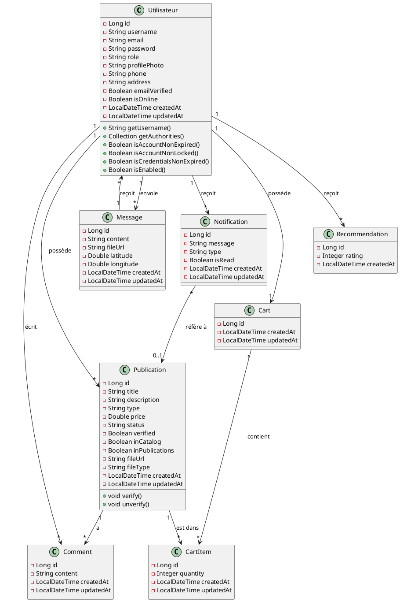

# Guide : Créer le Diagramme de Classes Global

## Vue d'ensemble

Le diagramme de classes représente la structure des entités de votre application, leurs attributs, méthodes et relations.

## Étape 1 : Accéder à Draw.io

1. Allez sur **https://app.diagrams.net/**
2. Cliquez sur **"Create New Diagram"**
3. Choisissez **"Blank Diagram"**
4. Donnez un nom : "Diagramme de Classes - Fixer"

## Étape 2 : Structure des Classes

### Classe 1 : Utilisateur

```
┌─────────────────────────────────────────┐
│          Utilisateur                    │
├─────────────────────────────────────────┤
│ - id: Long                              │
│ - username: String                      │
│ - email: String                         │
│ - password: String                      │
│ - role: String                          │
│ - profilePhoto: String                  │
│ - phone: String                         │
│ - address: String                       │
│ - emailVerified: Boolean                │
│ - isOnline: Boolean                     │
│ - createdAt: LocalDateTime              │
│ - updatedAt: LocalDateTime              │
├─────────────────────────────────────────┤
│ + getUsername(): String                 │
│ + getAuthorities(): Collection          │
│ + isAccountNonExpired(): Boolean        │
│ + isAccountNonLocked(): Boolean         │
│ + isCredentialsNonExpired(): Boolean    │
│ + isEnabled(): Boolean                  │
└─────────────────────────────────────────┘
```

**Relations :**
- 1 → * Publication (un utilisateur a plusieurs publications)
- 1 → * Comment (un utilisateur a plusieurs commentaires)
- 1 → * Message (un utilisateur envoie plusieurs messages)
- 1 → * Notification (un utilisateur a plusieurs notifications)
- 1 → 1 Cart (un utilisateur a un panier)

### Classe 2 : Publication

```
┌─────────────────────────────────────────┐
│          Publication                    │
├─────────────────────────────────────────┤
│ - id: Long                              │
│ - title: String                         │
│ - description: String                   │
│ - type: String                          │
│ - price: Double                         │
│ - status: String                        │
│ - verified: Boolean                     │
│ - inCatalog: Boolean                    │
│ - inPublications: Boolean                │
│ - fileUrl: String                       │
│ - fileType: String                      │
│ - createdAt: LocalDateTime              │
│ - updatedAt: LocalDateTime              │
├─────────────────────────────────────────┤
│ + verify(): void                        │
│ + unverify(): void                      │
└─────────────────────────────────────────┘
```

**Relations :**
- * → 1 Utilisateur (plusieurs publications appartiennent à un utilisateur)
- 1 → * Comment (une publication a plusieurs commentaires)
- 1 → * CartItem (une publication peut être dans plusieurs paniers)

### Classe 3 : Comment

```
┌─────────────────────────────────────────┐
│          Comment                        │
├─────────────────────────────────────────┤
│ - id: Long                              │
│ - content: String                       │
│ - createdAt: LocalDateTime              │
│ - updatedAt: LocalDateTime              │
└─────────────────────────────────────────┘
```

**Relations :**
- * → 1 Utilisateur (plusieurs commentaires appartiennent à un utilisateur)
- * → 1 Publication (plusieurs commentaires appartiennent à une publication)

### Classe 4 : Message

```
┌─────────────────────────────────────────┐
│          Message                        │
├─────────────────────────────────────────┤
│ - id: Long                              │
│ - content: String                       │
│ - fileUrl: String                       │
│ - latitude: Double                      │
│ - longitude: Double                     │
│ - createdAt: LocalDateTime              │
│ - updatedAt: LocalDateTime              │
└─────────────────────────────────────────┘
```

**Relations :**
- * → 1 Utilisateur (expéditeur) (plusieurs messages sont envoyés par un utilisateur)
- * → 1 Utilisateur (destinataire) (plusieurs messages sont reçus par un utilisateur)

### Classe 5 : Notification

```
┌─────────────────────────────────────────┐
│          Notification                   │
├─────────────────────────────────────────┤
│ - id: Long                              │
│ - message: String                       │
│ - type: String                          │
│ - isRead: Boolean                       │
│ - createdAt: LocalDateTime              │
│ - updatedAt: LocalDateTime              │
└─────────────────────────────────────────┘
```

**Relations :**
- * → 1 Utilisateur (plusieurs notifications appartiennent à un utilisateur)

### Classe 6 : Cart (Panier)

```
┌─────────────────────────────────────────┐
│          Cart                           │
├─────────────────────────────────────────┤
│ - id: Long                              │
│ - createdAt: LocalDateTime              │
│ - updatedAt: LocalDateTime              │
└─────────────────────────────────────────┘
```

**Relations :**
- 1 → 1 Utilisateur (un panier appartient à un utilisateur)
- 1 → * CartItem (un panier contient plusieurs articles)

### Classe 7 : CartItem (Article du Panier)

```
┌─────────────────────────────────────────┐
│          CartItem                       │
├─────────────────────────────────────────┤
│ - id: Long                              │
│ - quantity: Integer                     │
│ - createdAt: LocalDateTime              │
│ - updatedAt: LocalDateTime              │
└─────────────────────────────────────────┘
```

**Relations :**
- * → 1 Cart (plusieurs articles appartiennent à un panier)
- * → 1 Publication (un article correspond à une publication)

### Classe 8 : Recommendation

```
┌─────────────────────────────────────────┐
│          Recommendation                 │
├─────────────────────────────────────────┤
│ - id: Long                              │
│ - rating: Integer                       │
│ - createdAt: LocalDateTime              │
└─────────────────────────────────────────┘
```

**Relations :**
- * → 1 Utilisateur (plusieurs recommandations appartiennent à un utilisateur)

## Étape 3 : Comment créer dans Draw.io

### 1. Ajouter les Classes

1. Dans la barre latérale, cherchez **"UML"** ou tapez "class" dans la recherche
2. Glissez-déposez l'icône **"Class"** (rectangle avec 3 sections) sur le canvas
3. Double-cliquez sur le rectangle pour éditer :
   - **Section 1 (haut)** : Nom de la classe (ex: "Utilisateur")
   - **Section 2 (milieu)** : Attributs (ex: "- id: Long")
   - **Section 3 (bas)** : Méthodes (ex: "+ getUsername(): String")

### 2. Format des Attributs et Méthodes

- **Attributs** : Commencez par `-` (privé) ou `+` (public)
- **Méthodes** : Commencez par `+` (public)
- Utilisez `:` pour indiquer le type (ex: `- id: Long`)

### 3. Ajouter les Relations

#### Relation 1 → * (Un à Plusieurs)

1. Utilisez l'outil **"Connector"** (flèche)
2. Cliquez sur "Utilisateur" et tirez vers "Publication"
3. Double-cliquez sur la flèche pour ajouter les cardinalités :
   - Côté Utilisateur : `1`
   - Côté Publication : `*` ou `0..*`
4. Ajoutez le label : `possède` ou `a`

#### Relation * → 1 (Plusieurs à Un)

- Même procédure mais dans l'autre sens

#### Relation 1 → 1 (Un à Un)

- Utilisez une flèche simple avec `1` de chaque côté

### 4. Types de Relations

- **Association simple** : Ligne simple avec flèche
- **Composition** (diamant plein) : Si une classe ne peut exister sans l'autre
- **Agrégation** (diamant vide) : Si une classe peut exister sans l'autre

## Étape 4 : Organisation du Diagramme

### Disposition recommandée :

```
                    [Utilisateur]
                         |
        ┌────────────────┼────────────────┐
        |                |                 |
    [Publication]    [Message]      [Notification]
        |                |                 |
    [Comment]       [Cart]            [CartItem]
        |
    [Recommendation]
```

### Placement des classes :

1. **Utilisateur** : Au centre (classe principale)
2. **Publication** : À gauche de Utilisateur
3. **Comment** : En dessous de Publication
4. **Message** : À droite de Utilisateur
5. **Notification** : En haut à droite
6. **Cart** : En bas à droite
7. **CartItem** : En dessous de Cart
8. **Recommendation** : En bas, isolée

## Étape 5 : Relations Détaillées

### Relations à créer :

1. **Utilisateur → Publication** (1 → *)
   - Label : "possède" ou "publie"
   - Cardinalité : 1 → *

2. **Utilisateur → Comment** (1 → *)
   - Label : "écrit"
   - Cardinalité : 1 → *

3. **Utilisateur → Message** (1 → *) [Expéditeur]
   - Label : "envoie"
   - Cardinalité : 1 → *

4. **Utilisateur → Message** (1 → *) [Destinataire]
   - Label : "reçoit"
   - Cardinalité : 1 → *

5. **Utilisateur → Notification** (1 → *)
   - Label : "reçoit"
   - Cardinalité : 1 → *

6. **Utilisateur → Cart** (1 → 1)
   - Label : "possède"
   - Cardinalité : 1 → 1

7. **Publication → Comment** (1 → *)
   - Label : "a"
   - Cardinalité : 1 → *

8. **Publication → CartItem** (1 → *)
   - Label : "est dans"
   - Cardinalité : 1 → *

9. **Cart → CartItem** (1 → *)
   - Label : "contient"
   - Cardinalité : 1 → *

10. **Utilisateur → Recommendation** (1 → *)
    - Label : "reçoit" ou "a"
    - Cardinalité : 1 → *

## Étape 6 : Styliser le Diagramme

1. **Couleurs** :
   - Classes principales : Fond blanc, bordure noire
   - Vous pouvez utiliser des couleurs différentes pour chaque groupe

2. **Police** :
   - Nom de classe : Gras, taille 14
   - Attributs/Méthodes : Normal, taille 11
   - Type : Italique

3. **Espacement** :
   - Utilisez l'outil "Align" pour aligner les classes
   - Espacez régulièrement pour la lisibilité

## Étape 7 : Exporter

1. Cliquez sur **"File"** → **"Export as"** → **"PNG"**
2. Résolution : **300 DPI**
3. Cochez **"Transparent background"**
4. Cliquez sur **"Export"**
5. Sauvegardez dans : `images/diagrammes/classes.png`

## Code PlantUML (Alternative)

Si vous préférez utiliser PlantUML, voici le code :



Vous pouvez utiliser ce code sur https://www.plantuml.com/plantuml/uml/

## Vérification Finale

Avant d'exporter, vérifiez :
- ✅ Toutes les classes sont présentes
- ✅ Tous les attributs principaux sont listés
- ✅ Les méthodes importantes sont indiquées
- ✅ Toutes les relations sont correctes
- ✅ Les cardinalités sont correctes (1, *, 1..*, etc.)
- ✅ Le diagramme est lisible et bien organisé
- ✅ Les noms sont clairs et sans fautes
- ✅ La résolution est suffisante (300 DPI minimum)

## Astuces

1. **Groupez visuellement** : Utilisez des rectangles de fond pour regrouper les classes par domaine (Authentification, Publications, Messagerie, etc.)

2. **Utilisez des couleurs** : 
   - Bleu pour les entités principales
   - Vert pour les entités de support
   - Orange pour les entités de relation

3. **Ajoutez un titre** : "Diagramme de Classes - Plateforme Fixer"

4. **Légende** : Ajoutez une légende expliquant les types de relations si nécessaire

